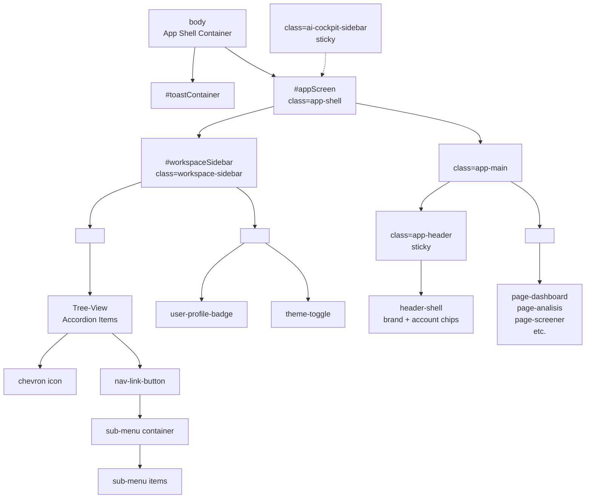

# Auto-Cuan UI Reconstruction Architecture Plan

## Executive Summary

This document outlines the comprehensive architecture plan for the Auto-Cuan UI reconstruction. The goal is to implement a **Single Shell SPA** with unified navigation, eliminating the double header bug, fixing sub-menu rendering, and establishing a clean design system.

---

## 1. Codebase Analysis Summary

### 1.1 Current Layout Architecture

**Key Files:**
- [`public/index.html`](public/index.html) — Main HTML shell (12,995 lines)
- [`public/index-shell.css`](public/index-shell.css) — Shell styles (805 lines)
- [`public/ui-theme.css`](public/ui-theme.css) — Design tokens and component styles (3,359 lines)
- [`public/unified-cockpit.css`](public/unified-cockpit.css) — Cockpit-specific styles (977 lines)
- [`public/premium-workstation.css`](public/premium-workstation.css) — Premium widget styles

**Current DOM Structure:**
```
<body>
  ├── #initialLoader
  ├── #blockedScreen
  ├── #maintenanceScreen
  ├── #serviceStatusScreen
  ├── #landingPage
  ├── #authChoiceModal
  ├── #loginModal / #registerModal
  ├── #appScreen (class="app-shell")
  │   ├── <aside id="workspaceSidebar" class="workspace-sidebar">
  │   │   ├── <nav class="sidebar-nav">
  │   │   │   └── <button class="sidebar-item"> elements
  │   │   └── <div class="sidebar-footer">
  │   ├── <main class="app-main">
  │   │   └── <header class="app-header">
  │   │       ├── .header-shell (brand + account)
  │   │       └── .mobile-nav-row > #mainNav
  │   │           └── <button class="nav-btn"> elements
  │   └── <div id="page-*"> content sections
  └── <div id="chatPanel"> (AI Cockpit sidebar)
```

### 1.2 Root Cause Analysis: Sub-Menu Text Rendering Bug

**Symptom:** Sub-menu "Analisis Saham" renders as raw paragraph text instead of buttons.

**Root Cause:** 
The navigation buttons are defined in index.html lines 570-605 as `<button class="nav-btn">` elements. If CSS class `.nav-btn` is not properly styled or is being overridden, the buttons may lose their button styling and render as plain text.

**Likely causes:**
1. CSS class conflict with Tailwind utilities not loading
2. `.nav-btn` styles being overridden by `!important` somewhere
3. The button elements losing their `<button>` semantics due to JavaScript DOM manipulation

### 1.3 Root Cause Analysis: Double Header Bug

**Symptom:** Double header appears on desktop view.

**Root Cause:**
The current implementation has TWO navigation locations:
1. `<aside class="workspace-sidebar">` — sidebar with `.sidebar-item` buttons (lines 470-504)
2. `<header class="app-header">` with `<nav class="mobile-nav-row">` containing `.nav-btn` buttons (lines 524-607)

On desktop, BOTH render visible when they should be mutually exclusive. The sidebar should be hidden on mobile, and the header nav strip should be hidden on desktop.

---

## 2. Design Tokens (Extracted from ui-theme.css)

### 2.1 Color System

| Token | Value | Usage |
|-------|-------|-------|
| `--ac-bg` | `#090d16` | Canvas background |
| `--ac-surface-1` | `#0f1420` | Panel/card ground |
| `--ac-surface-2` | `#141a27` | Raised blocks |
| `--ac-surface-3` | `#0b101a` | Recessed wells (inputs) |
| `--ac-accent` | `#34d399` | Emerald accent |
| `--ac-accent-strong` | `#10b981` | Deeper emerald |
| `--ac-text-strong` | `#f8fafc` | Primary text |
| `--ac-text` | `#dbe3ec` | Secondary text |
| `--ac-text-muted` | `#93a1b5` | Muted text |
| `--ac-bull` | `#34d399` | Bullish/positive |
| `--ac-bear` | `#f87171` | Bearish/negative |

### 2.2 Typography Scale

| Token | Value | Usage |
|-------|-------|-------|
| `--ac-text-micro` | 11px | Micro labels |
| `--ac-text-sm` | 12px | Small text |
| `--ac-text-base` | 14px | Body text |
| `--ac-text-lg` | 16px | Large text |
| `--ac-text-xl` | 20px | Headings |

### 2.3 Spacing System (4px base)

| Token | Value | Usage |
|-------|-------|-------|
| `--ac-space-1` | 4px | Tight spacing |
| `--ac-space-2` | 8px | Default spacing |
| `--ac-space-3` | 12px | Medium spacing |
| `--ac-space-4` | 16px | Standard spacing |
| `--ac-space-5` | 20px | Section spacing |
| `--ac-space-6` | 24px | Large spacing |
| `--ac-space-8` | 32px | XL spacing |

### 2.4 Radius Scale

| Token | Value | Tailwind Equivalent |
|-------|-------|---------------------|
| `--ac-radius-xs` | 6px | `rounded-md` |
| `--ac-radius-sm` | 8px | `rounded-lg` |
| `--ac-radius-md` | 12px | `rounded-xl` |
| `--ac-radius-lg` | 16px | `rounded-2xl` |
| `--ac-radius-xl` | 20px | `rounded-3xl` |

### 2.5 Active State Styling

From [`ui-theme.css:580-585`](public/ui-theme.css:580):
```css
.nav-btn.active {
  color: #6ee7b7;
  background: var(--ac-accent-soft); /* rgba(16, 185, 129, 0.10) */
  border-color: var(--ac-accent-line); /* rgba(52, 211, 153, 0.30) */
  box-shadow: inset 0 -2px 0 rgba(52, 211, 153, 0.45);
}
```

---

## 3. Single Shell SPA Architecture

### 3.1 DOM Architecture Diagram



### 3.2 Layout Grid Specification

**Desktop (≥1024px):**
```
┌─────────────────────────────────────────────────────────────────────┐
│ HEADER (sticky)                                                     │
│ [Brand] [Live Radar] [Safety] [Manual Confirm] ... [Account]       │
├──────────────┬──────────────────────────────────────┬──────────────┤
│ SIDEBAR      │ MAIN CONTENT                         │ CHAT PANEL   │
│ 240px fixed  │ flex: 1, overflow-y: auto            │ 320px        │
│              │                                      │ (optional)   │
│ ┌──────────┐ │ ┌──────────────────────────────────┐ │              │
│ │ Nav Tree │ │ │ Page Content                     │ │              │
│ │          │ │ │                                  │ │              │
│ │ ▶ Analis│ │ │                                  │ │              │
│ │   └ Saham│ │ │                                  │ │              │
│ │ ▶ Sektor │ │ │                                  │ │              │
│ │ ▶ Screener│ │ │                                  │ │              │
│ └──────────┘ │ └──────────────────────────────────┘ │              │
│              │                                      │              │
├──────────────┴──────────────────────────────────────┴──────────────┤
│ FOOTER (inline flex)                                                │
│ [BU budi ADMIN] [Version] [Links]                                  │
└─────────────────────────────────────────────────────────────────────┘
```

**Mobile (<1024px):**
```
┌─────────────────────────┐
│ HEADER (sticky)         │
│ [☰] [Brand] [Account]  │
├─────────────────────────┤
│ MAIN CONTENT            │
│ flex: 1, overflow-y     │
│                         │
│                         │
│                         │
├─────────────────────────┤
│ FOOTER                  │
└─────────────────────────┘
```

### 3.3 CSS Flexbox Architecture

```css
/* Shell Container */
.app-shell {
  display: flex;
  flex-direction: column;
  min-height: 100vh;
}

/* Main Area (Header + Content) */
.app-main {
  display: flex;
  flex-direction: column;
  flex: 1;
}

/* 2-Column Layout (Sidebar + Content) */
.app-body {
  display: flex;
  flex: 1;
  overflow: hidden;
}

/* Sidebar */
.workspace-sidebar {
  width: 240px;
  flex-shrink: 0;
  display: flex;
  flex-direction: column;
  border-right: 1px solid var(--ac-line);
  background: var(--ac-bg);
}

@media (max-width: 1023px) {
  .workspace-sidebar {
    position: fixed;
    left: -280px;
    top: 0;
    bottom: 0;
    z-index: 100;
    transition: left 0.3s ease;
  }
  
  .workspace-sidebar.open {
    left: 0;
  }
}

/* Content Area */
#contentArea {
  flex: 1;
  overflow-y: auto;
  padding: 16px;
}

/* Footer - Horizontal by default */
.app-footer {
  display: flex;
  flex-direction: row;
  align-items: center;
  gap: 16px;
  padding: 8px 16px;
  border-top: 1px solid var(--ac-line);
  background: var(--ac-surface-1);
}

@media (max-width: 640px) {
  .app-footer {
    flex-direction: column;
    text-align: center;
  }
}
```

---

## 4. 4-Pillar Architecture

### Pillar 1: Shell Layout

**Objective:** Unified single shell without duplicate headers.

**Implementation:**
1. Remove duplicate navigation: Keep ONLY sidebar on desktop, mobile bottom nav
2. Single `<header class="app-header">` at top
3. Sidebar with tree-view accordion for desktop
4. Mobile: hamburger menu opens sidebar overlay

**Files to modify:**
- [`public/index.html`](public/index.html) — Remove `.mobile-nav-row` from header, consolidate nav
- [`public/index-shell.css`](public/index-shell.css) — Add mobile sidebar toggle styles

### Pillar 2: Tree-View Navigation

**Objective:** Accordion sub-menu with chevron arrows, proper button elements.

**Implementation:**
```css
/* Tree-View Item */
.tree-item {
  display: flex;
  flex-direction: column;
}

.tree-item-header {
  display: flex;
  align-items: center;
  gap: 8px;
  padding: 8px 12px;
  cursor: pointer;
  border-radius: var(--ac-radius-sm);
  transition: background 0.15s ease;
}

.tree-item-header:hover {
  background: var(--ac-surface-hover);
}

.tree-item-header.active {
  background: var(--ac-accent-soft);
  color: var(--ac-accent);
}

/* Chevron rotation */
.tree-chevron {
  width: 16px;
  height: 16px;
  transition: transform 0.2s ease;
}

.tree-item.open > .tree-item-header .tree-chevron {
  transform: rotate(90deg);
}

/* Sub-menu */
.tree-submenu {
  display: none;
  padding-left: 24px;
}

.tree-item.open > .tree-submenu {
  display: block;
}

/* Sub-menu items as proper buttons */
.tree-submenu-item {
  display: flex;
  align-items: center;
  gap: 8px;
  padding: 6px 12px;
  border-radius: var(--ac-radius-sm);
  font-size: 13px;
  cursor: pointer;
  transition: all 0.15s ease;
}

.tree-submenu-item:hover {
  background: var(--ac-surface-hover);
  color: var(--ac-text);
}

.tree-submenu-item.active {
  background: var(--ac-accent-soft);
  color: var(--ac-accent);
}
```

### Pillar 3: Active State Styling

**Objective:** Consistent emerald accent for active states across all navigation.

**Implementation:**
```css
/* Active Navigation State */
.nav-item.active,
.nav-btn.active,
.tree-submenu-item.active {
  background: rgba(16, 185, 129, 0.12);
  color: #10b981;
  border-color: rgba(52, 211, 153, 0.30);
  box-shadow: inset 0 -2px 0 rgba(52, 211, 153, 0.45);
}

/* Focus State (WCAG AA) */
.nav-item:focus-visible,
.nav-btn:focus-visible,
.tree-submenu-item:focus-visible {
  outline: 2px solid rgba(52, 211, 153, 0.75);
  outline-offset: 2px;
}

/* Hover State */
.nav-item:hover:not(.active),
.nav-btn:hover:not(.active),
.tree-submenu-item:hover:not(.active) {
  background: rgba(148, 163, 184, 0.08);
  color: var(--ac-text);
}
```

### Pillar 4: Widget Cleanup

**Objective:** Remove duplicate/unused widgets, standardize card styles.

**Implementation:**
1. Audit and remove orphaned widget containers
2. Standardize all cards to use `.ac-surface` primitive
3. Fix footer "BU budi ADMIN" to use horizontal flex layout

---

## 5. 20-Phase Verification Checklist

### Phase 1-5: Foundation
- [ ] **Phase 1:** Remove `.mobile-nav-row` from header, verify single nav location
- [ ] **Phase 2:** Implement CSS sidebar with `display: flex`, `width: 240px`
- [ ] **Phase 3:** Add mobile hamburger toggle with sidebar overlay
- [ ] **Phase 4:** Create `.tree-item` CSS for accordion structure
- [ ] **Phase 5:** Implement `.tree-chevron` rotation animation

### Phase 6-10: Navigation
- [ ] **Phase 6:** Convert nav items to proper `<button>` elements with `onclick`
- [ ] **Phase 7:** Add sub-menu container with `display: none/block`
- [ ] **Phase 8:** Implement tree open/close toggle in JavaScript
- [ ] **Phase 9:** Add `.active` class styling for current page
- [ ] **Phase 10:** Add keyboard navigation support (Tab, Enter, Arrow keys)

### Phase 11-15: Content & Widgets
- [ ] **Phase 11:** Migrate page content to `#contentArea`
- [ ] **Phase 12:** Standardize all card components to `.ac-surface`
- [ ] **Phase 13:** Fix footer horizontal layout with flexbox
- [ ] **Phase 14:** Remove duplicate widget containers
- [ ] **Phase 15:** Add responsive breakpoints (640px, 1024px, 1280px)

### Phase 16-20: Polish & Testing
- [ ] **Phase 16:** Verify WCAG AA contrast on all text
- [ ] **Phase 17:** Test keyboard navigation flow
- [ ] **Phase 18:** Run headless browser screenshot verification (10 runs)
- [ ] **Phase 19:** Cross-browser testing (Chrome, Firefox, Safari)
- [ ] **Phase 20:** Final visual regression against screenshots

---

## 6. Headless Browser Screenshot Plan

### 6.1 Screenshot Verification Script

```javascript
// tools/verify-ui-reconstruction.js
const puppeteer = require('puppeteer');
const fs = require('fs');
const path = require('path');

const BASE_URL = process.env.BASE_URL || 'http://localhost:3000';
const OUTPUT_DIR = path.join(__dirname, '../audit-screenshots');

const SCREENSHOTS = [
  { name: '01-desktop-dashboard.png', width: 1280, height: 800 },
  { name: '02-desktop-analisis.png', width: 1280, height: 800 },
  { name: '03-desktop-sidebar-open.png', width: 1280, height: 800 },
  { name: '04-mobile-dashboard.png', width: 375, height: 667 },
  { name: '05-mobile-sidebar-open.png', width: 375, height: 667 },
  { name: '06-footer-horizontal.png', width: 1280, height: 200 },
  { name: '07-active-nav-state.png', width: 1280, height: 800 },
];

async function captureScreenshots() {
  const browser = await puppeteer.launch({ headless: 'new' });
  const context = browser.defaultBrowserContext();
  
  for (const shot of SCREENSHOTS) {
    const page = await context.newPage();
    await page.setViewport({ width: shot.width, height: shot.height });
    
    // Run 10 times per screenshot for consistency
    for (let run = 1; run <= 10; run++) {
      const filename = `${shot.name.replace('.png', '')}_run${run}.png`;
      const filepath = path.join(OUTPUT_DIR, filename);
      
      try {
        await page.goto(BASE_URL, { waitUntil: 'networkidle0', timeout: 30000 });
        await page.screenshot({ path: filepath, fullPage: false });
        console.log(`✓ Captured: ${filename}`);
      } catch (err) {
        console.error(`✗ Failed: ${filename} - ${err.message}`);
      }
    }
    
    await page.close();
  }
  
  await browser.close();
  console.log('\nScreenshots complete.');
}

captureScreenshots();
```

### 6.2 Verification Checklist for Each Screenshot

| Screenshot | Verification Points |
|------------|---------------------|
| 01-desktop-dashboard | Single header visible, sidebar collapsed, no double header |
| 02-desktop-analisis | Tree-view expanded, sub-menu items are buttons |
| 03-desktop-sidebar-open | Sidebar 240px, overlay visible on mobile |
| 04-mobile-dashboard | Hamburger menu visible, no sidebar |
| 05-mobile-sidebar-open | Sidebar slides in from left |
| 06-footer-horizontal | Footer items in horizontal flex, "BU budi ADMIN" in row |
| 07-active-nav-state | Active item has emerald background #10b981 at 12% opacity |

---

## 7. Oracle VPS Deployment Strategy

### 7.1 Deployment Command

```bash
ssh -o ConnectTimeout=15 -o ServerAliveInterval=20 -o ServerAliveCountMax=12 \
  -i "D:\Private Key Oracle\ssh-key-2026-07-02.key" \
  ubuntu@168.110.221.197 "bash -s" < deploy/vps/deploy-4-critical-fixes.sh
```

### 7.2 Deployment Script Flow

1. **Pre-flight Check:** Verify PM2 process status
2. **Code Pull:** `git pull origin main`
3. **Dependencies:** `npm ci --production`
4. **Build:** `npm run build`
5. **Test:** `npm test`
6. **Deploy:** `pm2 reload ecosystem.config.js --update-env`
7. **Verify:** Health check endpoint `/api/health`
8. **Rollback:** If failed, `pm2 revert` to previous version

### 7.3 PM2 Configuration

```javascript
// ecosystem.config.js
module.exports = {
  apps: [{
    name: 'auto-cuan',
    script: 'server.js',
    instances: 1,
    exec_mode: 'cluster',
    env: {
      NODE_ENV: 'production',
      PORT: 3000
    },
    max_memory_restart: '500M',
    restart_delay: 4000
  }]
};
```

---

## 8. Risk Assessment

| Risk | Probability | Impact | Mitigation |
|------|-------------|--------|------------|
| Tailwind CSS conflict | Medium | High | Ensure `.nav-btn` styles load after Tailwind |
| Mobile sidebar z-index | Medium | Medium | Set sidebar z-index: 100, scrim z-index: 99 |
| Chart widget data loss | Low | Critical | Backup data before widget removal |
| Regression in other pages | Medium | Medium | Full screenshot suite before/after |

---

## 9. Success Criteria

1. **No double header** on desktop viewport (1280px+)
2. **Sub-menu "Analisis Saham"** renders as clickable buttons, not paragraph text
3. **Footer "BU budi ADMIN"** displays in horizontal row
4. **Active navigation** uses emerald accent (`rgba(16, 185, 129, 0.12)`)
5. **All 10 screenshot runs** pass visual verification
6. **No console errors** in browser DevTools
7. **WCAG AA contrast** maintained on all text elements

---

*Document Version: 1.0*
*Created: 2026-09-27*
*Status: Ready for User Review*
